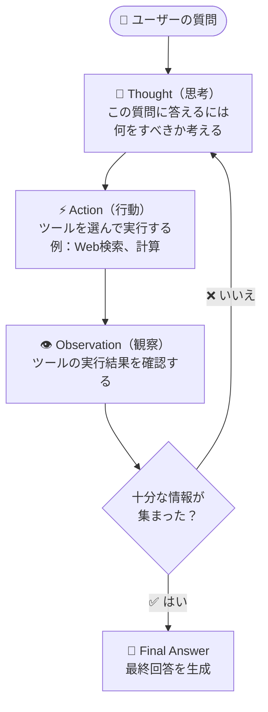
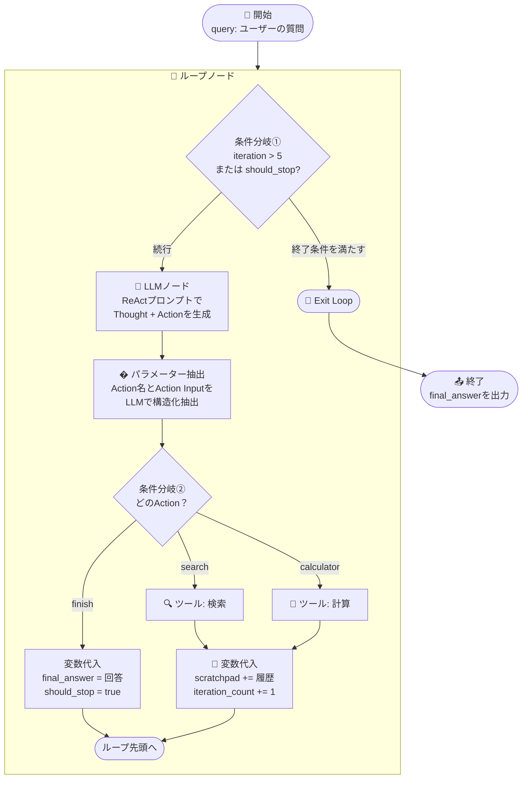

# 第4回：エージェントの基本とワークフロー実装

## 📋 概要

**所要時間:** 90分
**形式:** ハンズオン + 講義

### 学習目標

* AIエージェントの基本概念と、Difyにおける2つの実装方法を理解する
* ReAct（Reasoning + Acting）パターンの思考サイクルを理解する
* ワークフローノードのみでReActエージェントを構築できるようになる

### DoD（Definition of Done）

- [ ] ReActパターンの3ステップサイクル（Thought → Action → Observation）を説明できる
- [ ] Difyのループノード・条件分岐・変数代入を使ったReActワークフローを構築済み
- [ ] 構築したエージェントがツールを呼び出して質問に回答できることを確認済み

---

## 🎯 第4回の構成（90分）

### 1. エージェントとは何か？（15分）

#### 1.1 ワークフローとエージェントの違い（おさらい）

第1回で学んだDifyのアプリケーションタイプを振り返りましょう。

| タイプ | 動き方 | 例え |
|---|---|---|
| **Workflow（ワークフロー）** | あらかじめ決めた手順通りに処理する | レシピ通りに料理する |
| **Agent（エージェント）** | 目標に向けて自分で判断しながら動く | 冷蔵庫の中身を見て献立を考える料理人 |

ワークフローは「決まったレールの上を走る電車」、エージェントは「目的地だけ伝えれば自分でルートを考えるカーナビ付きの車」です。

**では、エージェントはどうやって "自分で判断" しているのでしょうか？**

その答えが、今回学ぶ **ReActパターン** という仕組みです。

#### 1.2 Difyにおけるエージェント実装の2つの方法

Difyでは、エージェント的な動作を2つの方法で実現できます。

**方法①：エージェントブロックを使う（Built-in）**

Difyが用意した「エージェント」アプリケーションタイプを使う方法です。設定画面でツールを追加するだけで、LLMが自動的にツールを選んで実行してくれます。

* ✅ **メリット:** 設定が簡単、すぐに使い始められる
* ⚠️ **デメリット:** 内部の動作が見えにくい、細かい制御がしにくい

**方法②：ワークフローノードで自作する（本セクションの主題）**

ワークフローの各種ノード（ループ、条件分岐、LLM、変数代入など）を組み合わせて、エージェントの思考・行動サイクルを自分で構築する方法です。

* ✅ **メリット:** 動作の透明性が高い、細かいカスタマイズが可能、仕組みへの深い理解が得られる
* ⚠️ **デメリット:** 設定が複雑、ワークフロー設計の知識が必要

#### 1.3 なぜワークフローで自作するのか？

今回あえて「方法②（ワークフロー自作）」を選ぶ理由は3つあります。

1. **透明性**: 「AIが今何を考えて、なぜそのツールを選んだのか」が一目で分かる
2. **カスタマイズ性**: プロンプトやループ回数、エラー処理など、すべてを自分で制御できる
3. **学習効果**: エージェントの内部動作を体感的に理解でき、方法①を使う際にも応用が効く

> **💡 ヒント:** まずは方法②で仕組みを理解し、その後は用途に応じて方法①と使い分けるのがおすすめです。

---

### 2. ReActパターンの理解（15分）

#### 2.1 ReAct（Reasoning + Acting）とは

**ReAct** は「**Re**asoning（推論）」と「**Act**ing（行動）」を組み合わせた言葉で、LLMが **考える → 行動する → 結果を見る** のサイクルを繰り返して問題を解決する手法です。

従来のLLMは「質問されたら一発で回答する」だけでしたが、ReActパターンでは、LLMが自らの知識の限界を認識し、**外部ツール（Web検索、計算機、データベースなど）を使って情報を集めながら段階的に答えを導き出します**。

#### 2.2 ReActの3ステップサイクル

ReActパターンは次の3つのステップを繰り返します。



| ステップ | 役割 | 例 |
|---|---|---|
| **Thought（思考）** | 「次に何をすべきか」を考える | 「天気を聞かれたが、自分は最新情報を持っていない。検索が必要だ」 |
| **Action（行動）** | ツールを選んで実行する | 「検索ツールに "東京 天気 今日" と入力する」 |
| **Observation（観察）** | 結果を読んで状況を把握する | 「検索結果によると、東京は晴れ、最高気温18度だ」 |

#### 2.3 具体例で理解する

**ユーザーの質問：**「東京スカイツリーの高さは何メートルで、それはエッフェル塔の何倍？」

この質問に対し、ReActパターンでは以下のように処理が進みます。

**サイクル1:**
> **Thought:** 東京スカイツリーの高さを知る必要がある。検索しよう。
> **Action:** search「東京スカイツリー 高さ」
> **Observation:** 東京スカイツリーの高さは634メートルです。

**サイクル2:**
> **Thought:** スカイツリーは634mと分かった。次はエッフェル塔の高さが必要だ。
> **Action:** search「エッフェル塔 高さ」
> **Observation:** エッフェル塔の高さは330メートルです。

**サイクル3:**
> **Thought:** 両方の高さが分かった。634 ÷ 330 を計算しよう。
> **Action:** calculator「634 / 330」
> **Observation:** 1.921...

**最終回答:**
> **Thought:** 必要な情報がすべて揃った。回答をまとめよう。
> **Final Answer:** 東京スカイツリーの高さは634メートルで、エッフェル塔（330メートル）の約1.9倍です。

> **📝 ポイント:** LLMが「一発で全部答える」のではなく、**1ステップずつ確実に情報を集めて積み上げていく**のがReActパターンの特徴です。これにより、ハルシネーション（AIの作り話）を大幅に減らせます。

---

### 3. Difyワークフローで再現するReActパターン（20分）

ここからは、ReActパターンをDifyのワークフローノードだけで構築する方法を設計していきます。

#### 3.1 使用するノードの全体像

以下のノードを組み合わせて、ReActの思考-行動-観察サイクルを実現します。

| ノード | ReActでの役割 | 説明 |
|---|---|---|
| **開始 (Start)** | ユーザー入力の受け取り | ユーザーの質問を`query`変数として受け取る |
| **ループ (Loop)** | サイクルの反復制御 | ReActの繰り返しを管理する |
| **LLM** | Thought（思考） | 状況を分析し、次のActionを決定する |
| **パラメーター抽出 (Parameter Extractor)** | 出力のパース | LLMの出力からAction名とInputを構造化データとして抽出する |
| **条件分岐 (IF/ELSE)** | 分岐判定 | 終了条件の判定、Actionの振り分け |
| **ツール (Tool)** | Action（行動） | 外部ツール（検索、計算など）を実行する |
| **変数代入 (Variable Assigner)** | Observation（観察）の蓄積 | 思考と結果の履歴を更新する |
| **ループ終了 (Exit Loop)** | 最終回答でのループ離脱 | `finish`アクション時にループを抜ける |
| **終了 (End)** | 最終回答の出力 | `final_answer`を出力する |

#### 3.2 ループノード vs イテレーションノード

Difyには「ループ」と「イテレーション」の2種類の繰り返しノードがあります。ReActパターンでは**ループノード一択**です。

| 特性 | ループノード ✅ | イテレーションノード ❌ |
|---|---|---|
| **ラウンド間の依存** | 前ラウンドの結果を引き継げる | 各ラウンドは独立 |
| **用途** | 逐次的な推論（ReAct向き） | バッチ処理（一括変換向き） |
| **変数の引き継ぎ** | ループ変数で可能 | 不可 |

> **💡 なぜループノードなのか？** ReActでは「前のObservation結果が次のThought入力になる」ため、ラウンド間でデータを引き継ぐ必要があります。これはループノードでしか実現できません。

#### 3.3 ワークフロー全体のフロー図

構築するワークフローの全体像です。



#### 3.4 各ノードの役割と設定ポイント

##### ① ループ変数の設計

ループノードに以下の4つのループ変数を設定します。これらはReActサイクルの「記憶」として機能します。

| 変数名 | 型 | 初期値 | 役割 |
|---|---|---|---|
| `iteration_count` | Number | `0` | ループ回数のカウンター（無限ループ防止） |
| `scratchpad` | String | `""` | 思考・行動・観察の履歴を蓄積する「メモ帳」 |
| `final_answer` | String | `""` | 最終回答を格納する変数 |
| `should_stop` | String | `"false"` | 終了フラグ（`"true"`で停止） |

> **📝 `scratchpad`が最も重要な変数です。** 毎回のThought・Action・Observationをここに追記していくことで、LLMが過去の思考履歴を参照しながら次のステップを決定できるようになります。これこそがReActの「推論チェーン」の実体です。

##### ② LLMノード：ReActプロンプトの設計

LLMノードには、ReActの「思考」を行わせるプロンプトを設定します。**これがエージェント全体の頭脳**であり、最も重要な設定です。

```
あなたはReActパターンで動作するAIアシスタントです。
ユーザーの質問に対して、一歩ずつ考えながらツールを使って回答を導き出します。

## 利用可能なツール
- search: Web検索を行います。入力には検索クエリを指定してください。
- calculator: 数値計算を行います。入力には計算式を指定してください。

## これまでの思考と観察の履歴
{{scratchpad}}

## ユーザーの質問
{{query}}

## 回答ルール
以下のフォーマットで厳密に回答してください。フォーマットから外れないでください。

Thought: [現在の状況を分析し、次に何をすべきか1〜2文で記述]
Action: [使用するツール名を1つだけ記載。選択肢: search / calculator / finish]
Action Input: [ツールへの入力内容。finishの場合は最終回答の全文]

## 重要な注意
- 1回につき1つのActionのみ実行してください
- 十分な情報が集まったら必ず Action: finish を使ってください
- Action Input にはツールへの入力のみを記載してください
```

> **💡 プロンプト設計のポイント:**
> * `{{scratchpad}}` と `{{query}}` はDifyの変数参照構文です。LLMノードの変数設定で、ループ変数と開始ノードの変数をそれぞれ紐付けます。
> * フォーマットの指示は重要ですが、次のステップでパラメーター抽出ノードを使うため、多少の揺れには対応できます。

##### ③ パラメーター抽出ノード：ActionとInputの構造化抽出

Difyの **パラメーター抽出（Parameter Extractor）ノード** を使って、LLMの出力テキストから `action` と `action_input` を構造化データとして抽出します。

> **💡 なぜコードノードではなくパラメーター抽出ノードを使うのか？**
>
> | 観点 | コードノード（正規表現） | パラメーター抽出ノード ✅ |
> |---|---|---|
> | 設定の難易度 | Pythonの正規表現の知識が必要 | GUIで項目を追加するだけ |
> | フォーマット崩れへの耐性 | 厳密なフォーマット遵守が必要 | LLMが柔軟に解釈して抽出 |
> | プログラミング不要 | ❌ コードを書く必要あり | ✅ ノーコードで設定可能 |

**パラメーター抽出ノードの設定:**

1. **「パラメーター抽出」** ノードを追加
2. **入力変数:** LLMノードの出力テキストを設定
3. **抽出するパラメーター** を以下のように定義：

| パラメーター名 | 型 | 必須 | 説明 |
|---|---|---|---|
| `action` | String | ✅ | 使用するツール名（search / calculator / finish のいずれか） |
| `action_input` | String | ✅ | ツールへの入力内容。finishの場合は最終回答の全文 |

4. **モデル:** `gemini-2.5-flash`（または利用可能なモデル）を選択
5. **補足指示（Instruction）** に以下を入力：

```
テキストからAction名（search / calculator / finish のいずれか）と、そのActionへの入力内容を抽出してください。
```

> **📝 ポイント:** パラメーター抽出ノードは内部でLLMを使ってテキストを解析するため、LLMの出力フォーマットが多少崩れても正確にパラメーターを抽出できます。コードノードで正規表現を書く場合と比べて、はるかにロバスト（頑健）です。

##### ④ 条件分岐のロジック

**条件分岐①（ループ継続 / 終了の判定）:**

| 条件 | 遷移先 |
|---|---|
| `iteration_count` > 5 | Exit Loop（安全停止） |
| `should_stop` == `"true"` | Exit Loop（最終回答到達） |
| それ以外 | LLMノードへ（ループ続行） |

**条件分岐②（Actionの振り分け）:**

| 条件 | 遷移先 |
|---|---|
| `action` == `"finish"` | 変数代入（final_answer設定 + should_stop設定） |
| `action` == `"search"` | 検索ツールノード |
| `action` == `"calculator"` | 計算ツールノード |

##### ⑤ 変数代入によるscratchpad蓄積

**ツール実行後の変数更新（最も重要な処理）:**

以下の2つの変数を更新します。

1. **`iteration_count`**: 現在の値に 1 を加算
2. **`scratchpad`**: 以下の形式で履歴を追記

```
[既存のscratchpad内容]
Thought: [LLMが出力したThought]
Action: [実行したAction名]
Action Input: [Actionへの入力]
Observation: [ツールの実行結果]
```

こうすることで、次のループでLLMが `{{scratchpad}}` を読んだとき、**過去のすべての思考・行動・結果を参照でき**、重複した検索や堂々巡りを避けられます。

**finishアクション時の変数更新:**

1. **`final_answer`**: パラメーター抽出ノードで抽出した `action_input`（= 最終回答の本文）を設定
2. **`should_stop`**: `"true"` を設定

---

### 4. ハンズオン：ReActエージェントの構築（30分）

実際にDifyでReActエージェントを構築しましょう。

#### 4.1 完成イメージ

構築するのは、ユーザーの質問に対してWeb検索と計算ツールを使いながら段階的に調査し、最終回答を返す**リサーチアシスタント**です。

**動作例:**
```
ユーザー: 東京タワーとエッフェル塔の高さの差は？

エージェントの内部処理:
  [Thought] 東京タワーの高さを検索する必要がある
  [Action] search → 「東京タワー 高さ」
  [Observation] 333メートル

  [Thought] エッフェル塔の高さも検索する
  [Action] search → 「エッフェル塔 高さ」
  [Observation] 330メートル

  [Thought] 差を計算する
  [Action] calculator → 「333 - 330」
  [Observation] 3

  [Thought] 情報が揃った
  [Action] finish

最終回答: 東京タワー（333m）とエッフェル塔（330m）の高さの差は3メートルです。
```

#### 4.2 ステップ1: 新規Chatflowの作成

1. Difyダッシュボードで **「Studio」** を選択
2. **「Create Application」** をクリック
3. **「Chatflow」** を選択
4. 以下を入力：
   * **Application Name:** 「ReActリサーチアシスタント」
   * **Description:** 「ReActパターンで動作するリサーチエージェント」
5. **「Create」** をクリック

#### 4.3 ステップ2: ループノードとループ変数の設定

1. ワークフローエディタで **「ループ」** ノードを追加
2. ループノードの設定画面で **「ループ変数」** を追加：

| 変数名 | 型 | 初期値 |
|---|---|---|
| `iteration_count` | Number | `0` |
| `scratchpad` | String | （空文字） |
| `final_answer` | String | （空文字） |
| `should_stop` | String | `false` |

3. 開始ノードの出力をループノードに接続

#### 4.4 ステップ3: 条件分岐①（終了条件チェック）

ループ内の最初のノードとして **「条件分岐（IF/ELSE）」** を追加します。

**IF条件の設定:**
* `iteration_count` が `5` より大きい **OR**
* `should_stop` が `true` と等しい

**Then（条件一致）:** → Exit Loopノードへ接続
**Else（条件不一致）:** → LLMノードへ接続

#### 4.5 ステップ4: LLMノードとReActプロンプトの設定

1. **「LLM」** ノードを追加
2. モデルを **「gemini-2.5-flash」** に設定
3. **Temperature** を **0.2** に設定（安定した出力のため低めに設定）
4. **System Prompt** に、セクション3.4②で示したReActプロンプトをコピー＆ペースト
5. 変数の紐付け：
   * `{{scratchpad}}` → ループ変数の `scratchpad`
   * `{{query}}` → 開始ノードの `sys.query`

> **⚠️ 重要:** Temperatureは低めに設定してください。高すぎるとフォーマットが崩れやすくなり、パラメーター抽出の精度が低下する可能性があります。

#### 4.6 ステップ5: パラメーター抽出ノードによるアクション抽出

1. **「パラメーター抽出」** ノードを追加
2. LLMノードの出力を入力変数として接続
3. 抽出パラメーターを追加：
   * `action`（String / 必須）— 説明: 「使用するツール名（search / calculator / finish）」
   * `action_input`（String / 必須）— 説明: 「ツールへの入力内容。finishの場合は最終回答」
4. モデルを選択（例: `gemini-2.5-flash`）
5. 補足指示に「テキストからAction名とそのActionへの入力内容を抽出してください」と入力

#### 4.7 ステップ6: 条件分岐②（Actionの振り分け）

1. **「条件分岐（IF/ELSE）」** ノードを追加
2. 条件を設定：

**IF:** `action` が `finish` と等しい → 最終回答用の変数代入ノードへ
**ELIF:** `action` が `search` と等しい → 検索ツールノードへ
**ELIF:** `action` が `calculator` と等しい → 計算ツールノードへ

#### 4.8 ステップ7: ツールノードの接続

**検索ツールノード:**
1. **「ツール」** ノードを追加し、利用可能な検索ツール（例：Google Search、SerpAPI など）を選択
2. 検索クエリに `action_input` を設定

**計算ツールノード:**
1. **「コード」** ノードを追加（簡易的な計算ノードとして利用）
2. 以下のPython計算コードを設定：

```python
def main(expression: str) -> dict:
    try:
        result = str(eval(expression))
    except Exception as e:
        result = f"計算エラー: {str(e)}"
    return {"result": result}
```

> **💡 ヒント:** Difyのツールマーケットプレイスから検索ツールをインストールして使用することもできます。利用できるツールは環境によって異なるため、講師の指示に従ってください。

#### 4.9 ステップ8: 変数代入ノードでscratchpadを更新

**ツール実行後の変数更新ノード:**

1. **「変数代入」** ノードを追加
2. 以下の変数を更新：

* `iteration_count` → `iteration_count + 1`
* `scratchpad` → 既存の `scratchpad` に以下を追記：
  ```
  Thought + Action + Observation の履歴
  ```

**finishアクション用の変数代入ノード:**

1. 別の **「変数代入」** ノードを追加
2. 以下の変数を更新：
   * `final_answer` → `action_input`（最終回答テキスト）
   * `should_stop` → `"true"`

#### 4.10 ステップ9: テストと動作確認

1. ループノードの後に **「終了」** ノードを追加し、出力変数に `final_answer` を設定
2. 右側の **「Preview」** パネルを開く
3. 以下の質問でテストしてみましょう：

**テスト質問1（シンプルな検索）:**
```
日本で一番高い山の標高は？
```

**テスト質問2（複数ステップ）:**
```
東京タワーとスカイツリーの高さを調べて、その合計を教えて
```

**テスト質問3（ツール不要のケース）:**
```
1 + 1 は？
```

4. 各ステップでのThought・Action・Observationが正しく動作しているか、ループの実行ログを確認

#### 4.11 うまくいかない場合のトラブルシューティング

| 症状 | 原因 | 対処法 |
|---|---|---|
| LLMがフォーマット通りに出力しない | Temperatureが高すぎる / プロンプトが曖昧 | Temperatureを0.1〜0.2に下げる。プロンプトに出力例を追加する |
| パラメーター抽出が正しく動作しない | 抽出パラメーターの説明が不十分 | パラメーターの「説明」をより具体的に記述する。補足指示（Instruction）に例を追加する |
| 無限ループになる | finishが呼ばれない | `iteration_count` の上限を確認。プロンプトに「情報が揃ったら必ずfinishを使え」と強調する |
| ツールがエラーを返す | APIキー未設定 / ツール未インストール | Settings > Tools でツールの設定を確認 |
| scratchpadが蓄積されない | 変数代入の設定ミス | 変数代入ノードで「追記（Append）」になっているか確認 |

---

### 5. 質疑応答とまとめ（10分）

#### 5.1 本日のまとめ

今日学んだこと：

✅ エージェントの基本概念と、ワークフロー型との違い
✅ ReActパターンの3ステップサイクル（Thought → Action → Observation）
✅ Difyのループノード・条件分岐・変数代入を使ったReActワークフローの設計
✅ 実際にReActエージェントを構築し、動作を確認

#### 5.2 エージェントブロックとの使い分け指針

| 状況 | おすすめの方法 |
|---|---|
| 手軽にエージェントを試したい | **方法①:** エージェントブロック |
| 思考過程を細かく制御したい | **方法②:** ワークフロー自作（今回学んだ方法） |
| 特定のツール呼び出し順序を保証したい | **方法②:** ワークフロー自作 |
| プロトタイプを素早く作りたい | **方法①:** エージェントブロック |
| エージェントの動作原理を学習したい | **方法②:** ワークフロー自作 |

#### 5.3 FAQ

**Q1: ループの最大回数は何回が適切ですか？**

A: 一般的には **5〜10回** が推奨です。少なすぎると複雑な質問に答えられず、多すぎるとAPIコストがかさみます。まずは5回で始めて、必要に応じて調整してください。

**Q2: エージェントブロックと今回の方法、どちらが正確ですか？**

A: 精度はプロンプトの質とモデルの能力に依存するため、一概には言えません。ただし、ワークフロー自作の方がプロンプトを細かく調整でき、特定のユースケースに最適化しやすいメリットがあります。

**Q3: ReAct以外のパターン（Plan-and-Executeなど）もワークフローで作れますか？**

A: はい、可能です。Plan-and-Executeの場合は、最初のLLMノードでタスクリストを生成し、イテレーションノードで各タスクを順次実行する構成になります。ただしReActの方がシンプルで学習に最適です。

**Q4: 利用できるツールが検索と計算以外にもありますか？**

A: Difyにはツールマーケットプレイスがあり、Google検索、DALL·E（画像生成）、Wikipedia、天気API、Slackなど50以上のツールが利用可能です。カスタムHTTPリクエストでAPIを呼び出すことも可能です。

---

## 📚 参考リソース

### 公式ドキュメント

* [Dify公式ドキュメント - ワークフロー](https://docs.dify.ai/guides/workflow)
* [Dify公式ドキュメント - ループノード](https://docs.dify.ai/guides/workflow/node/loop)
* [Dify公式ドキュメント - エージェント](https://docs.dify.ai/guides/application-orchestrate/agent)

### ReActパターン関連

* [ReAct論文（Yao et al., 2022）](https://arxiv.org/abs/2210.03629) — ReActパターンの元論文
* [AI Agent Basics - セクション1: エージェントの全体像](../../../ai-agent-basics/section-01-overview/README.md) — ReActを含むエージェントパターンの概要解説

---

## 🎓 付録

### A. トラブルシューティング

#### A.1 LLMの出力がフォーマット通りにならない

**症状:** Thought/Action/Action Inputの形式で出力されない

**解決方法:**
1. Temperatureを **0.1〜0.2** に下げる
2. プロンプトの指示を明確化し、出力例を含める：
   ```
   ## 出力例
   Thought: ユーザーは天気を知りたいので、検索が必要です。
   Action: search
   Action Input: 東京 天気 今日
   ```
3. モデルを変更してみる（`gemini-2.5-flash` → `gemini-3-pro`）

#### A.2 ループが1回で終了してしまう

**症状:** 最初のループで常にfinishが選ばれる

**解決方法:**
1. プロンプトに「**外部ツールを使って正確な情報を確認してから回答してください**」と追加
2. `scratchpad`の初期値を空のままにしているか確認（初期値に何か入っていると挙動が変わる場合がある）

### B. ReActプロンプトテンプレート（コピペ用）

以下をそのままLLMノードのSystem Promptに貼り付けて使用できます。

```
あなたはReActパターンで動作するAIアシスタントです。
ユーザーの質問に対して、一歩ずつ考えながらツールを使って回答を導き出します。

## 利用可能なツール
- search: Web検索を行います。入力には検索クエリを指定してください。
- calculator: 数値計算を行います。入力には計算式を指定してください。

## これまでの思考と観察の履歴
{{scratchpad}}

## ユーザーの質問
{{query}}

## 回答ルール
以下のフォーマットで厳密に回答してください。フォーマットから外れないでください。

Thought: [現在の状況を分析し、次に何をすべきか1〜2文で記述]
Action: [使用するツール名を1つだけ記載。選択肢: search / calculator / finish]
Action Input: [ツールへの入力内容。finishの場合は最終回答の全文]

## 重要な注意
- 1回につき1つのActionのみ実行してください
- 十分な情報が集まったら必ず Action: finish を使ってください
- Action Input にはツールへの入力のみを記載してください
```

### C. 用語集

| 用語 | 説明 |
|------|------|
| **ReAct** | Reasoning + Acting の略。思考→行動→観察のサイクルでタスクを解決する手法 |
| **Thought（思考）** | LLMが「次に何をすべきか」を推論するステップ |
| **Action（行動）** | LLMが外部ツールを選択・実行するステップ |
| **Observation（観察）** | ツールの実行結果をLLMが受け取るステップ |
| **scratchpad（メモ帳）** | 思考・行動・観察のすべての履歴を蓄積する変数 |
| **パラメーター抽出ノード** | LLMを使ってテキストから特定のパラメーターを構造化データとして抽出するDifyのノード |
| **ループノード** | 前のラウンドの結果を引き継ぎながら処理を繰り返すDifyのノード |
| **イテレーションノード** | 各ラウンドが独立して動作するバッチ処理向きのDifyのノード |
| **ループ変数** | ループノード内でラウンド間のデータ受け渡しに使用する変数 |
| **Exit Loop** | 条件を満たした時点でループを抜けるノード |
| **Function Calling** | LLMが構造化された形式でツール呼び出しを指示するAPI機能 |
| **ハルシネーション** | AIが事実に基づかない情報をもっともらしく生成してしまう現象 |

---

## ✅ チェックリスト

本日の内容を完了したか確認しましょう：

- [ ] ReActパターンの3ステップサイクルを理解した
- [ ] ワークフローでエージェントを自作する利点を理解した
- [ ] Chatflowアプリケーションを新規作成した
- [ ] ループノードとループ変数を設定した
- [ ] LLMノードにReActプロンプトを設定した
- [ ] パラメーター抽出ノードでAction/Inputの抽出を設定した
- [ ] 条件分岐でActionの振り分けを設定した
- [ ] ツールノード（検索・計算）を接続した
- [ ] 変数代入でscratchpadの更新を設定した
- [ ] テスト質問で正しく動作することを確認した

すべてチェックできたら、ReActパターンのエージェント構築は完了です！

---

**お疲れさまでした！次回もよろしくお願いします。** 🎉
